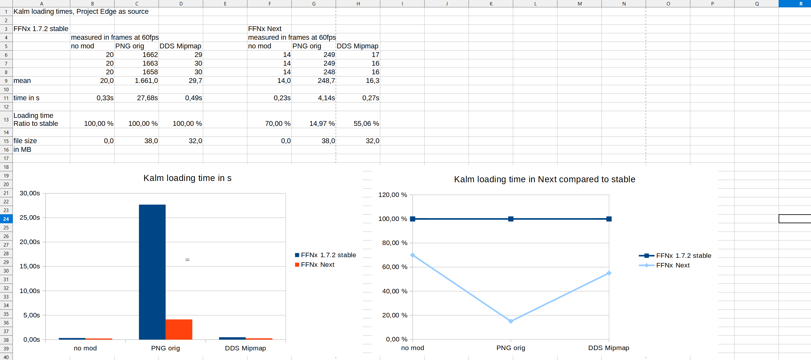

# Next

- Full commit list since last stable release: https://github.com/julianxhokaxhiu/FFNx/compare/1.22.0...master

## Common

- Core: Improve error message on crash and make the link clickable

## FF7

- Core: Fix core game bug issue happening on the wind wall fields `woa_*` ( https://github.com/julianxhokaxhiu/FFNx/issues/797 )

## FF8

- External textures: Fix Rinoa battle model that do not get replaced ( https://github.com/julianxhokaxhiu/FFNx/pull/790 )

# 1.22.0

- Full commit list since last stable release: https://github.com/julianxhokaxhiu/FFNx/compare/1.21.3...1.22.0

## Commmon

- Core: Users can now choose on which screen to run the game, using the new `display_index` option.
- Music: Add the ability to play a custom `main_menu` music file on the new game screen.

## FF7

- Core: Fix memory leak when using the field chunk functionality ( https://github.com/julianxhokaxhiu/FFNx/issues/768 )
- Cheats: Use equipped Attack behavior when using auto-attack shortcut ( https://github.com/julianxhokaxhiu/FFNx/pull/773 )
- Music: Allow to use a custom music track per world map area ( music files will have an `_aXX` format appended to the file name, where XX is the area ID )
- Rendering: Add uncrop option to remove black bars from top/bottom of the screen ( https://github.com/julianxhokaxhiu/FFNx/pull/767 )

## FF8

- Input: Fix regression supporting native Steam input config when using the native launcher.
- Modding: Allow modding card texts hardcoded in exe ( https://github.com/julianxhokaxhiu/FFNx/pull/774 )
- Modding: Allow modding draw texts hardcoded in exe ( https://github.com/julianxhokaxhiu/FFNx/pull/774 )
- Rendering: Fix red cross not showing in GF boost ability when ff8_use_gamepad_icons is enabled ( https://github.com/julianxhokaxhiu/FFNx/pull/784 )
- SFX: Fix incorrect volume assignment when playing sfx effects using the external layer

# 1.21.3

- Full commit list since last stable release: https://github.com/julianxhokaxhiu/FFNx/compare/1.21.2...1.21.3

## FF7 Steam

- Achievements: Fix unlocking achievements when using Steam

## FF8 Steam

- Choco: Create a custom driver that allows to launch the mini game without the need of a custom protocol

# 1.21.2

- Full commit list since last stable release: https://github.com/julianxhokaxhiu/FFNx/compare/1.21.1...1.21.2

## FF7

- Core: Fix field chunk size calculation for the chunk number 9 ( https://github.com/julianxhokaxhiu/FFNx/pull/763 )

# 1.21.1

- Full commit list since last stable release: https://github.com/julianxhokaxhiu/FFNx/compare/1.21.0...1.21.1

## FF7

- Core: Fix loading field lgp files that might have incorrect headers ( https://github.com/julianxhokaxhiu/FFNx/issues/758 )

## FF8

- External textures: Fix texture not reloaded between fields ( https://github.com/julianxhokaxhiu/FFNx/pull/761 )

## FF8 Steam

- Input: Fix button schema mapping

# 1.21.0

- Full commit list since last stable release: https://github.com/julianxhokaxhiu/FFNx/compare/1.20.3...1.21.0

## Common

- Core: Fix bgfx crash when memory cannot be allocated ( https://github.com/julianxhokaxhiu/FFNx/pull/755 )
- Voice: Add support for `config.toml` configuration override based on Game Moment ID

## FF8

- Core: Fix crash for non-us versions introduced in 1.20.3 ( https://github.com/julianxhokaxhiu/FFNx/pull/741 )
- Core: Fix crash when `more_debug` option is enabled ( https://github.com/julianxhokaxhiu/FFNx/pull/749 )
- Ambient: Fix missing Battle ID for battles triggered using field opcodes
- Ambient: Fix Battle ID detection for random encounters in Field
- Modding: Fix blending in external textures ( https://github.com/julianxhokaxhiu/FFNx/pull/749 )
- Modding: Allow modding card names hardcoded in exe ( https://github.com/julianxhokaxhiu/FFNx/pull/739 )
- Modding: Add compatibility to LZ4 compression in FS archives ( https://github.com/julianxhokaxhiu/FFNx/pull/741 https://github.com/julianxhokaxhiu/FFNx/pull/743/files )
- Rendering: Add support for substractive blending ( https://github.com/julianxhokaxhiu/FFNx/pull/750 )
- Voice: Add support for Worldmap question dialogs
- Voice: Add support for Auto text in World messages

# 1.20.3

- Full commit list since last stable release: https://github.com/julianxhokaxhiu/FFNx/compare/1.20.2...1.20.3

## FF7

- Music: Fix battle ID detection ( https://github.com/julianxhokaxhiu/FFNx/issues/738 )

## FF8

- Core: Fix Card Game mode and allow it to run at 60 FPS

# 1.20.2

- Full commit list since last stable release: https://github.com/julianxhokaxhiu/FFNx/compare/1.20.1...1.20.2

## FF7 Steam

- Core: Fix crash when entering Config menu in Spanish ( https://github.com/julianxhokaxhiu/FFNx/discussions/735 )

# 1.20.1

- Full commit list since last stable release: https://github.com/julianxhokaxhiu/FFNx/compare/1.20.0...1.20.1

## FF7

- Core: Add missing Cloud models in the model to eye mapping list

## FF8

- Core: Fix crash on JP version ( https://github.com/julianxhokaxhiu/FFNx/pull/733 )
- Movie: Fix `override_path` support ( TrueOdin + https://github.com/julianxhokaxhiu/FFNx/pull/734 )

## FF8 2000

- Movie: Fix path lookup when using ffmpeg ( https://github.com/julianxhokaxhiu/FFNx/issues/730 )

# 1.20.0

- Full commit list since last stable release: https://github.com/julianxhokaxhiu/FFNx/compare/1.19.1...1.20.0

## Common

- Audio: Fix bug that won't allow to configure vanilla SFX IDs using the `sfx/config.toml` file
- Audio: Fix bug where overriding only fade flags in `ambient/config.toml` would not allow the ambient audio file to be loaded
- Audio: Warn user in logs if the `config.toml` file was not parsed correctly, instead of failing silently
- Audio: Allow customising Ambient tracks volume via `config.toml`
- Audio: Ensure Ambient does not stop currently playing track if new one requested does not exist
- External textures: Reuse already loaded textures on fallback to palette 0 ( https://github.com/julianxhokaxhiu/FFNx/pull/692 https://github.com/julianxhokaxhiu/FFNx/pull/707 )
- Modding: Allow replacing EXE text/data hardcoded in code ( https://github.com/julianxhokaxhiu/FFNx/pull/699 )
- Rendering: Add bilinear filtering option `enable_bilinear` ( https://github.com/julianxhokaxhiu/FFNx/pull/692 )

## FF7

- Core: Fix mouth replacement for main characters, by replacing only model where the KAWAI opcode has been called.
- Core: NPCs can now have custom eyes and mouths, each their own, during the whole lifecycle of a field scene.
- Core: Fix blinking to use the correct closed eyes texture for NPCs
- Rendering: Fix wrong rendering for fonts in Field mode while scrolling.
- Rendering: Fix wrong rendering for timer boxes when using normal window mode.
- Widescreen: Added option to clip camera position during scripted events ( https://github.com/julianxhokaxhiu/FFNx/pull/706 )
- Widescreen: Added feature to extend movies in true widescreen mode ( https://github.com/julianxhokaxhiu/FFNx/pull/700 )
- 60FPS: Fix bug that displayed battle text too quickly when set at full SLOW speed

## FF8

- 60FPS: Add support for 60FPS in the entire game ( separate mods are still required for a stable gameplay )
- Audio: Add ambient layer support for Fields and Battles
- Audio: Add new override logics for Music by using Battle ID, Party Leader and Field name.
- Audio: Add support for current triangle ID for SFX
- External textures: Add support for modding VRAM pages directly, like Tonberry Mods does, see [documentation](https://github.com/julianxhokaxhiu/FFNx/blob/master/docs/ff8/mods/external_textures.md) ( https://github.com/julianxhokaxhiu/FFNx/pull/687 https://github.com/julianxhokaxhiu/FFNx/pull/692 https://github.com/julianxhokaxhiu/FFNx/pull/696 https://github.com/julianxhokaxhiu/FFNx/pull/712 https://github.com/julianxhokaxhiu/FFNx/pull/716 )
- External textures: Fix filename lookup which can match more textures than it should in a VRAM page ( https://github.com/julianxhokaxhiu/FFNx/pull/687 )
- External textures: Split `battle/A8DEF.TIM` into three files to avoid redundant textures ( https://github.com/julianxhokaxhiu/FFNx/pull/687 )
- External music: Fix music get stopped in Fisherman's Horizon concert ( https://github.com/julianxhokaxhiu/FFNx/pull/694 )
- Files: Enable support for `override_path` option ( https://github.com/julianxhokaxhiu/FFNx/pull/705 https://github.com/julianxhokaxhiu/FFNx/pull/707 )
- Rendering: Avoid texture reupload in case of palette swap ( https://github.com/julianxhokaxhiu/FFNx/pull/687 )
- Rendering: Fix texture unload when multiple palettes are written ( https://github.com/julianxhokaxhiu/FFNx/pull/687 )
- Rendering: Prevent the game from sending textures with half-alpha colors ( https://github.com/julianxhokaxhiu/FFNx/pull/687 )
- SFX: Add missing support for audio effects to be stopped in time
- Speedhack: Fix support in field which were not getting the real speed up despite FFNx prompting it on screen.

# FF8 2000

- Audio: Creative EAX Unified is now optional to launch the game ( https://github.com/julianxhokaxhiu/FFNx/pull/718 )

# FF8 Steam

- Files: Fix `app_path` option support ( https://github.com/julianxhokaxhiu/FFNx/pull/714 )

# 1.19.1

- Full commit list since last stable release: https://github.com/julianxhokaxhiu/FFNx/compare/1.19.0...1.19.1

## Common

- Core: Expose current Wine and Proton version as well in the log, if detected.
- Core: Fix crash that happened on startup on certain machine configurations while fetching PC specs.

## FF8

> **Important:** If you have installed [FFNx-v1.19.0.0](https://github.com/julianxhokaxhiu/FFNx/releases/tag/1.19.0), please remove the directories `mods/Textures/battle` and `mods/Textures/magic` and reinstall your battle mods if you had any. A lots of PNG textures has been wrongly dumped into those directories ( https://github.com/julianxhokaxhiu/FFNx/pull/685 )

- Rendering: Do not dump any textures if save_textures flag is false ( https://github.com/julianxhokaxhiu/FFNx/pull/685 )
- Rendering: Fix game over crash with external texture ( https://github.com/julianxhokaxhiu/FFNx/pull/686 )

# 1.19.0

- Full commit list since last stable release: https://github.com/julianxhokaxhiu/FFNx/compare/1.18.1...1.19.0

## Common

- Core: Add a new capability that will expose the current PC config (CPU, GPU including Driver version, RAM and OS) used to run FFNx. This will help a lot during troubleshooting.
- Music: Add new [relative_speed](https://github.com/julianxhokaxhiu/FFNx/blob/master/misc/FFNx.music.toml#L29-L31) option in the config layer ( https://github.com/julianxhokaxhiu/FFNx/pull/672 )

## FF7

- Modding: Do not replace eyes if no external texture has been found.
- Rendering: Fix wrong rendering for battle limit boxes when using transparency. Usually notices while using ESUI or FFNx default hext files.
- Rendering: Fix wrong rendering for overlapping message boxes. Usually noticed while using custom mods like SYW UI or Kactuar.
- Rendering: Fix world FX effects in DE, FR and SP editions.

## FF7 Steam

- Input: Prevent input configuration corruption after starting a new game and entering the Config menu ( https://github.com/julianxhokaxhiu/FFNx/pull/683 )

## FF8

- Core: Fix crash when some text windows are opening in worldmap on Spanish and Italian versions ( https://github.com/julianxhokaxhiu/FFNx/pull/682/files )
- Graphics: Fix texture animations by copy only partially animated ( https://github.com/julianxhokaxhiu/FFNx/pull/670 )
- Graphics: Allow more external texture replacement for battle effects ( https://github.com/julianxhokaxhiu/FFNx/pull/674 https://github.com/julianxhokaxhiu/FFNx/pull/676 )
- SFX: Fix some external SFX effects that were not stopping when they were looped in certain scenes
- Vibration: Added vibration option in the config menu and the battle pause menu ( https://github.com/julianxhokaxhiu/FFNx/pull/658 )
- Vibration: do not rely on hashes anymore to identify vibration data ( https://github.com/julianxhokaxhiu/FFNx/pull/675 )

## FF8 2000

- Misc: Update the FF8.reg file to disable the compatibility fix from Windows that disallow ALT+tab ( https://github.com/julianxhokaxhiu/FFNx/pull/670 )

## FF8 Steam

- Misc: Fix metadata save file preservation when a save file is created on Slot 2

# 1.18.1

- Full commit list since last stable release: https://github.com/julianxhokaxhiu/FFNx/compare/1.18.0...1.18.1

## Common

- Metadata: Fixes randomly disappearing save files, by rewriting completely the engine and patching `metadata.xml` only for the save file where the player saves

## FF7

- Input: Fixed auto-run not working sometimes on diagonals ( https://github.com/julianxhokaxhiu/FFNx/pull/666 )
- Input: Fixed not being able to place the flags during snowstorm ( https://github.com/julianxhokaxhiu/FFNx/pull/667 )
- Renderer: Fixed menu not working when using external worldmap mesh ( https://github.com/julianxhokaxhiu/FFNx/pull/657 )
- Widescreen: Fixed scripted camera clipping when widescreen enabled ( https://github.com/julianxhokaxhiu/FFNx/pull/664 )

## FF8 Steam

- Misc: Fix crash for the Japanese version ( https://github.com/julianxhokaxhiu/FFNx/pull/663 )

# 1.18.0

- Full commit list since last stable release: https://github.com/julianxhokaxhiu/FFNx/compare/1.17.1...1.18.0

## FF7

- Lighting: Fix Temple of the Ancients rolling stones color when `game_lighting` is set to `1` or `2` ( regression since 1.17.0 )
- Renderer: Fixed fog being incorrectly applied to Emerald Weapon battle ( https://github.com/julianxhokaxhiu/FFNx/pull/648 )
- Renderer: Preserve world camera state when changing game modes ( https://github.com/julianxhokaxhiu/FFNx/pull/651 )

## FF8

- Graphics: Add external textures replacement for magic.fs textures ( https://github.com/julianxhokaxhiu/FFNx/pull/646 )
- Graphics: Fix white textures in battle ( https://github.com/julianxhokaxhiu/FFNx/pull/646 )
- Graphics: Opimize PNG and DDS loading time ( https://github.com/julianxhokaxhiu/FFNx/pull/650 )
- Graphics: Minimize RAM usage of external textures and prevent crashes with big textures ( https://github.com/julianxhokaxhiu/FFNx/pull/650 )
- Graphics: Fix Tonberry compatibility layer for field background -again- ( https://github.com/julianxhokaxhiu/FFNx/pull/650 )
- Input: New option to show PlayStation gamepad icons when a gamepad is used ( https://github.com/julianxhokaxhiu/FFNx/pull/641 https://github.com/julianxhokaxhiu/FFNx/pull/650 )
- Input: Fix mapping of gamepad buttons when modified in the game ( https://github.com/julianxhokaxhiu/FFNx/pull/641 )
- Input: Fix inverted analog up/down direction for non-XInput controllers ( https://github.com/julianxhokaxhiu/FFNx/pull/647 )

## FF8 Steam

- Misc: Rewrite metadata file when a save file is created to prevent save file loss ( https://github.com/julianxhokaxhiu/FFNx/pull/655 )

# 1.17.1

- Full commit list since last stable release: https://github.com/julianxhokaxhiu/FFNx/compare/1.17.0...1.17.1

## Common

- Core: Hide cursor when the game is started in fullscreen mode ( https://github.com/julianxhokaxhiu/FFNx/pull/638 )

## FF7

- Renderer: Fixed fog rendering not working in underwater worldmap ( https://github.com/julianxhokaxhiu/FFNx/pull/639 )

## FF8

- Graphics: Fix Tonberry compatibility layer for field backgrouns ( https://github.com/julianxhokaxhiu/FFNx/pull/638 )

# 1.17.0

- Full commit list since last stable release: https://github.com/julianxhokaxhiu/FFNx/compare/1.16.0...1.17.0

## Common

- Logo: Fix intro logo showing up when `enable_lighting = true`
- Movie: Fix audio stream playing at the same time as the external audio
- Movie: Add support for the AV1 codec

## FF7

- 60FPS: Refactor 60FPS battle menu fix and fix ESUI compatibility ( https://github.com/julianxhokaxhiu/FFNx/pull/597 )
- 60FPS: Fix Submarine minigame ( https://github.com/julianxhokaxhiu/FFNx/issues/621 )
- Ambient: Allow ambient effects to playback in fields that use movies as background
- Core: Add additional main models eye-to-model mapping
- Core: Add ability to replace eye textures with custom one ( https://github.com/julianxhokaxhiu/FFNx/issues/589 )
- Core: Add ability to replace mouth textures with custom one
- DevTools: Add Game Moment in Field Debug
- Input: Added right analog stick camera scrolling controls in field mode
- Lighting: Fix [`config.toml`](https://github.com/julianxhokaxhiu/FFNx/blob/master/misc/FFNx.lighting.toml) load/save logic
- Lighting: Fix Bahamut Zero and Supernova not displaying correctly when lighting enabled
- Lighting: Fix field shadows not displaying during FMV movies
- Lighting: Implemented GPU-based original game lighting that better matches PSX version
- Lighting: Fixed minor shadow visual glitches occurring in some fields
- Music: Fix overlapping external music tracks when `external_music_resume = false`
- Renderer: Fix black color in some field maps (`spipe2` for example) ( https://github.com/julianxhokaxhiu/FFNx/pull/587 )
- Renderer: Added functionality to replace worldmap rendering with an external 3d mesh
- Sound: Fix loading music volume value from ff7sound.cfg
- Voice: Enable tutorial voice acting
- Widescreen: Added experimental support for 16:10 aspect ratio
- Widescreen: Fix Pollensalta attack (only when also using 30/60FPS mode since it is a temporary fix) and Bahamut Zero summon background
- Widescreen: Fix Pandora Box white background position
- Voice: Fix auto-text sometimes not working on certain fields after long gameplay sessions

## FF7 Steam

- Common: Fix a softlock when trying to change in-game Controller setting to "Normal" (by disabling this option)
- Input: Fix character naming screen not working correctly when Steam Input is enabled

## FF8

- Hext: `fix_uv_coords` hext files are not needed anymore ( https://github.com/julianxhokaxhiu/FFNx/pull/619 )
- Graphics: Fix blue color on some attacks in battle ( https://github.com/julianxhokaxhiu/FFNx/pull/619 )
- Graphics: Fix crash when using external texture replacement ( https://github.com/julianxhokaxhiu/FFNx/pull/588 )
- Graphics: Fix texture glitches using external texture replacement ( https://github.com/julianxhokaxhiu/FFNx/pull/591 )
- Graphics: Fix external texture blending ( https://github.com/julianxhokaxhiu/FFNx/pull/598 https://github.com/julianxhokaxhiu/FFNx/pull/601 )
- Graphics: Add chara.one worldmap texture replacement ( https://github.com/julianxhokaxhiu/FFNx/pull/615 )
- Graphics: Add support for external texture animation ( https://github.com/julianxhokaxhiu/FFNx/pull/616 https://github.com/julianxhokaxhiu/FFNx/pull/628 )
- Graphics: Add support for multiple palettes in external texture ( https://github.com/julianxhokaxhiu/FFNx/pull/617 https://github.com/julianxhokaxhiu/FFNx/pull/628 )
- Graphics: Minimize texture uploads when the palette is not set yet ( https://github.com/julianxhokaxhiu/FFNx/pull/617 https://github.com/julianxhokaxhiu/FFNx/pull/628 )
- Graphics: Increase max texture size to 16384 for external textures ( https://github.com/julianxhokaxhiu/FFNx/pull/601 )
- Input: Enable support for 360° analog movement ( https://github.com/julianxhokaxhiu/FFNx/pull/632 )
- Input: Enable support dual-stick vehicle control ( https://github.com/julianxhokaxhiu/FFNx/pull/632 )
- Menu: Fix main menu texts when selecting "new game" option (European versions only) ( https://github.com/julianxhokaxhiu/FFNx/pull/636 )
- Music: Add `ff8_external_music_force_original_filenames` option to use original music names (eg 018s-julia.ogg) instead of just the main identifier in external music ( https://github.com/julianxhokaxhiu/FFNx/pull/594 )
- Music: Fix intro credits unsync ( https://github.com/julianxhokaxhiu/FFNx/pull/634 )
- SFX: Fix Quezacotl sounds ( https://github.com/julianxhokaxhiu/FFNx/pull/633 )
- Voice: Enable battle dialogs voice acting
- Voice: Enable worldmap voice acting
- Voice: Enable tutorial voice acting

# 1.16.0

- Full commit list since last stable release: https://github.com/julianxhokaxhiu/FFNx/compare/1.15.0...1.16.0

## Common

- Common: Allow to skip the FFNx logo on button press
- Common: Improve texture upload time by reducing allocations for color conversion
- Common: Add a new NTSC color correction option ( https://github.com/julianxhokaxhiu/FFNx/issues/536 )
- Common: Introduce a new volume management that can be managed via the `FFNx.toml` file ([Music](https://github.com/julianxhokaxhiu/FFNx/blob/master/misc/FFNx.toml#L195-L203), [SFX](https://github.com/julianxhokaxhiu/FFNx/blob/master/misc/FFNx.toml#L161-L169), [Voice](https://github.com/julianxhokaxhiu/FFNx/blob/master/misc/FFNx.toml#L257-L265), [Ambient](https://github.com/julianxhokaxhiu/FFNx/blob/master/misc/FFNx.toml#L297-L305), [Movie](https://github.com/julianxhokaxhiu/FFNx/blob/master/misc/FFNx.toml#L321-L329))
- GameHacks: Add toggle for Voice auto-text feature ( see https://github.com/julianxhokaxhiu/FFNx/blob/master/docs/shortcuts.md#voice-auto-text )
- Voice: Fix track master volume inheritance when overriding via config

## FF7

- 60FPS: Fix softlock on one of the last map (las0_5) ( https://github.com/julianxhokaxhiu/FFNx/discussions/569 )
- Core: Fix `ERROR: COULD NOT CHANGE TO DIRECTORY` error when starting the Condor minigame
- Graphics: Fix missing snow footsteps ( https://github.com/julianxhokaxhiu/FFNx/issues/550 )
- Input: Allow Cloud to walk/run based on the left analogue stick position ( https://github.com/julianxhokaxhiu/FFNx/issues/523 + https://github.com/julianxhokaxhiu/FFNx/issues/557 )
- Lighting: Fix model normal data inheritance
- Modding: Allow snowboard model swapping ( https://github.com/julianxhokaxhiu/FFNx/issues/440 )

## FF8

- Common: Fix startup hang on launch
- Common: Fix jp version crash
- Common: Fix ger version crash on entering worldmap
- Config: enable worldmap fixes by default
- Graphics: Add Field texture replacement ( https://github.com/julianxhokaxhiu/FFNx/pull/542 https://github.com/julianxhokaxhiu/FFNx/pull/545 )
- Graphics: Add Battle texture replacement ( https://github.com/julianxhokaxhiu/FFNx/pull/564 )
- Graphics: Add Worldmap texture replacement for roads and some vehicles ( https://github.com/julianxhokaxhiu/FFNx/pull/584 )
- Graphics: Fix wrong texture replacements in battle
- Graphics: Fix bad texture UVs in worldmap ( https://github.com/julianxhokaxhiu/FFNx/pull/564 )
- Graphics: Disable texture filtering for external textures, as sprites can overlap or look bad in FF8
- Voice: Rework the layer to correctly support field voice acting, multiple dialogs, option dialogs, voice auto-text, music fade-out-in on voice playback, etc.

# 1.15.0

- Full commit list since last stable release: https://github.com/julianxhokaxhiu/FFNx/compare/1.14.0...1.15.0

## Common

- Common: Introduce the FFNx logo on game start
- Modding: Add an extra override layer for external textures ( https://github.com/julianxhokaxhiu/FFNx/blob/master/misc/FFNx.toml#L365 )

## FF7

- 60FPS: Fix fading speed in FIELD mode screen transitions ( https://github.com/julianxhokaxhiu/FFNx/pull/503 )
- 60FPS: Fix fading out speed in BATTLE mode exit screen transition
- 60FPS: Fix Climhazzard random crash on enemies with status effects ( https://github.com/julianxhokaxhiu/FFNx/pull/516 )
- Core: Fix Barret's eyebrow not loading ( https://github.com/julianxhokaxhiu/FFNx/issues/107 )
- Modding: Added day-night time cycle system that can be controled from field scripts ( https://github.com/julianxhokaxhiu/FFNx/pull/511 )
- Modding: Add support for chunked kernel.bin/kernel2.bin sections
- Modding: Add support for chunked scene.bin sections
- Renderer: Fixed graphical glitch happening in battle when 3d models rendered in front of UI ( https://github.com/julianxhokaxhiu/FFNx/issues/131 )
- Renderer: Fix FIELD mode text box flickering rendering ( https://github.com/julianxhokaxhiu/FFNx/pull/525 )
- Voice: Add play voice for enemy actions during BATTLE mode ( https://github.com/julianxhokaxhiu/FFNx/pull/502 )
- Voice: Fix worldmap message opcode wrong dialog id
- Voice: Fix wrong ASK opcode initialization
- Voice: Fix auto-text behavior for Worldmap
- Widescreen: Allow the buster sword image on new game screen to support 16:9 ratio ( https://github.com/julianxhokaxhiu/FFNx/pull/506 )

## FF8

- SFX: Add external SFX audio effects for modders ( https://github.com/julianxhokaxhiu/FFNx/pull/510 )

# 1.14.0

- Full commit list since last stable release: https://github.com/julianxhokaxhiu/FFNx/compare/1.13.0...1.14.0

## Common

- Audio: Fix a minor glitch happening on long tracks that were looped ( https://github.com/julianxhokaxhiu/FFNx/issues/452 )
- Audio: Fix a minor glitch happening on OGG tracks that were looped until the end of the track ( https://github.com/julianxhokaxhiu/FFNx/issues/497 )
- Borderless: Fix debug info display when using this mode
- Borderless: Fix game aspect ratio when using borderless or switching to it on the fly
- Vulkan: Disable HDR support, brings more stability on top of AMD cards

## FF7

- 60FPS: Fix FIELD and WORLD mode text box animation speed (opening, closing, next paging)
- Animated textues: Optimizations that lead to major speed improvements on old/weak CPUs ( https://github.com/julianxhokaxhiu/FFNx/pull/494 )
- Fields: Move vertical centering [to be a flag](https://github.com/julianxhokaxhiu/FFNx/blob/master/misc/FFNx.toml#L554-L559) instead of a Hext file ( https://github.com/julianxhokaxhiu/FFNx/pull/486 )
- Lighting: Fixed minor graphical glitches happening in fields ( https://github.com/julianxhokaxhiu/FFNx/pull/475 )
- Lighting: Fixed visual glitches happening while using Antialiasing ( https://github.com/julianxhokaxhiu/FFNx/pull/476 )
- Lighting: Fixed various missing graphical elements through the overall game ( Titan missing floor, etc. ) ( https://github.com/julianxhokaxhiu/FFNx/pull/478 )
- Lighting: Minor code optimizations that lead to major speed improvements while using this mode
- Modding: Added support for chunked field files
- Modding: Added support for `direct/*.lgp` direct paths
- SFX: Fix a loop bug happening when using MIDI + External SFX combination ( https://github.com/julianxhokaxhiu/FFNx/issues/495 )
- Widescreen: Added config logic and zoom implementation
- Widescreen: Added logic to offset camera scrolling and minor other fixes
- Widescreen: Added logic for vertical offset in movies and other minor fixes
- Widescreen: 16:9 native support!

## FF8

- Fixed a crash that happened while exiting the game ( https://github.com/julianxhokaxhiu/FFNx/pull/479 )

# 1.13.0

- Full commit list since last stable release: https://github.com/julianxhokaxhiu/FFNx/compare/1.12.0...1.13.0

## Common

- Add native Borderless support ( see https://github.com/julianxhokaxhiu/FFNx/blob/master/docs/shortcuts.md#borderless and https://github.com/julianxhokaxhiu/FFNx/blob/master/misc/FFNx.toml#L30 )
- Fix a rare crash that might happen when closing the game while using 7th Heaven
- Voice: Allow users to enable/disable the auto-text feature ( see https://github.com/julianxhokaxhiu/FFNx/blob/master/misc/FFNx.toml#L221 )
- Steam: Improve metadata save logic ( see https://github.com/julianxhokaxhiu/FFNx/issues/459 )
- Shortcuts: Reworked the entire gamepad trigger logic ( see https://github.com/julianxhokaxhiu/FFNx/blob/master/docs/shortcuts.md )

## FF7

- 60FPS: Implement smooth FIELD background scrolling (3D models, tiles, cursor, and arrows)
- 60FPS: Fix model position glitch for some summons
- 60FPS: Fix FIELD 3D model blinking time and wait time
- FF7 Achievement: Fix bug about Cait Sith last limit break and Emerald Weapon achievements not achievable
- Voice: Add Worldmap voice acting support
- Fixed a crash happening while loading a save game on Steam Spanish language
- Fixed minor issues happening while using the new lighting engine on OpenGL ( see https://github.com/julianxhokaxhiu/FFNx/issues/448 )
- Fixed Summon SFX effects volume to respect the master sfx volume ( see https://github.com/julianxhokaxhiu/FFNx/issues/453 )
- Fixed Worldmap missing FX effects ( see https://github.com/julianxhokaxhiu/FFNx/issues/465 )

# 1.12.0

- Full commit list since last stable release: https://github.com/julianxhokaxhiu/FFNx/compare/1.11.0...1.12.0

## Common

- Fixed OpenGL rendering for Nvidia/Intel GPUs. AMD continues to have issues unfortunately.
- Fixed a rare buffer-overflow while rendering movies that could lead to crashes on certain game scenes
- SFX: Add a new [`skip`](https://github.com/julianxhokaxhiu/FFNx/blob/master/misc/FFNx.SFX.toml#L24-L27) option in the config layer

## FF7

- Added a new game hack, see https://github.com/julianxhokaxhiu/FFNx/blob/master/docs/shortcuts.md#toggle-music-on-battle-pause--ff7-only-
- Ambient global volume is now linked to the SFX global volume
- Movie volume is no more linked to the in-game global music volume
- Misc 60 FPS bugfixes
- XInput: Fix deadzone bug for analog triggers
- Lighting: Fix field 3D models shadow glitch
- SFX: Allow to always centre SFX effects by using the new flag `external_sfx_always_centered`
- Audio: Allow players to customize global Voice, Ambient and Movie volume

## FF8

- Misc gamepad vibration fixes on worldmap
- Xinput: fix controller button mapping for steam edition
- Misc Horizon concert fixes
- Graphics: Add Triple Triad mini-game texture replacement ( https://github.com/julianxhokaxhiu/FFNx/pull/444 )
- Graphics: Allow new high quality built-in Worldmap textures to load instead of the low quality ones [by enabling the relative flag in FFNx.toml](https://github.com/julianxhokaxhiu/FFNx/blob/master/misc/FFNx.toml#L561) ( https://github.com/julianxhokaxhiu/FFNx/pull/444 )

---

# 1.11.0

- Full commit list since last stable release: https://github.com/julianxhokaxhiu/FFNx/compare/1.10.1...1.11.0

## Common

- Added the ability to disable a track by name in External Music ( https://github.com/julianxhokaxhiu/FFNx/pull/318 )
- Improved the internal graphics autoscaling logic to enhance visual output as well as performance ( https://github.com/julianxhokaxhiu/FFNx/pull/364 )
- Added support for HDR mode ( see https://github.com/julianxhokaxhiu/FFNx/blob/master/misc/FFNx.toml#L96 )
  - **PLEASE NOTE:** HDR mode will be auto-enabled only when all these conditions apply:
    - Using DirectX 11/DirectX 12 as backend renderer
    - Windows has the HDR mode enabled
    - Your GPU and monitor supports HDR
- Added support for 5.1/7.1 audio setup

## FF7

- 60 FPS mode! ( see https://github.com/julianxhokaxhiu/FFNx/issues/347 for left-over bugs )
- New Auto-Attack GameHack ( https://github.com/julianxhokaxhiu/FFNx/pull/314 )
- New External Music feature: sync to start a track in sync with the previous one ( https://github.com/julianxhokaxhiu/FFNx/pull/318 )
- Various External Music improvements, including the ability to customize a boss battle music by battle scene ID, and to customize minigame music ( https://github.com/julianxhokaxhiu/FFNx/pull/318 + https://github.com/julianxhokaxhiu/FFNx/pull/334 )
- New special feature to play the music from the introduction via External Music, and not via the movie ( https://github.com/julianxhokaxhiu/FFNx/pull/337 )
- New audio layer to replace audio from movies ( https://github.com/julianxhokaxhiu/FFNx/pull/343 )
- New voice acting in Battle:
  - For generic text ( https://github.com/julianxhokaxhiu/FFNx/pull/322 )
  - For skills, magic and items ( https://github.com/julianxhokaxhiu/FFNx/pull/331 )
- New Battle camera control using the right analogue stick ( https://github.com/julianxhokaxhiu/FFNx/pull/340 )
- Various graphical fixes and optimizations on the Lighting engine
- Footsteps sound effect support in Worldmap ( https://github.com/julianxhokaxhiu/FFNx/pull/386 )
- Highwind sound effect support in Worldmap ( https://github.com/julianxhokaxhiu/FFNx/pull/402 )
- Fixed Ambient audio effect pause/resume logic in Battle
- Footsteps run sound effect now works correctly indipendent of the button layout configuration from the user
- Added support for voice acting when multiple dialogs are shown on screen
- Various fixes on the voice acting layer:
  - Prevent Auto-OK when the game engine does not allow user interaction on a specific dialog window
  - The Auto-OK feature now works indipendent of the button layout configuration from the user
- HUGE boost in performance when using animated textures even on weak CPUs
- Removed the Save Anywhere feature as it was causing more issues than benefits
- Movies will now continue to play while dragging the game window
- Fix achievement unlock on End of Part 1

## FF8

- Added vibration feature ( https://github.com/julianxhokaxhiu/FFNx/pull/415 )
- New voice audio layer to dub the game ( https://github.com/julianxhokaxhiu/FFNx/pull/412 )
- Added new supported modules (intro credits and cdcheck) to replace textures with DDS or PNG files ( https://github.com/julianxhokaxhiu/FFNx/pull/375 )
- New Direct Mode feature for FF8 ( https://github.com/julianxhokaxhiu/FFNx/pull/405 )
- Added support for japanese 1.02 (nvidia and non-nvidia) version of the game ( https://github.com/julianxhokaxhiu/FFNx/pull/417 )
- Fixed crash in the Chocobo World menu for the Steam version ( https://github.com/julianxhokaxhiu/FFNx/pull/414 )
- Fixed chocobo world Cloud save signature ( https://github.com/julianxhokaxhiu/FFNx/pull/330 )
- Various fixes for the External Music feature ( https://github.com/julianxhokaxhiu/FFNx/pull/330 )
- Fixed crash using debug tools on non-US version of the game ( https://github.com/julianxhokaxhiu/FFNx/pull/323 )
- Allow some Registry settings to be overridden via FFNx.toml ( https://github.com/julianxhokaxhiu/FFNx/pull/427 )
- Enable support for more debug output from the game engine ( https://github.com/julianxhokaxhiu/FFNx/pull/428 )

---

# 1.10.1

- Milestone: https://github.com/julianxhokaxhiu/FFNx/milestone/5?closed=1
- Full commit list since last stable release: https://github.com/julianxhokaxhiu/FFNx/compare/1.10.0...1.10.1

## Common

- Fixes Steam edition startup issue: game was crashing directly on startup.

## FF7

- Achievements are now more robust, as well as enabled by default on Steam releases. You might still need to enable the [relative flag](https://github.com/julianxhokaxhiu/FFNx/blob/master/misc/FFNx.toml#L244) on 1998 release.

---

# 1.10.0

- Milestone: https://github.com/julianxhokaxhiu/FFNx/milestone/3?closed=1
- Full commit list since last stable release: https://github.com/julianxhokaxhiu/FFNx/compare/1.9.0...1.10.0

## Common

- Add support for PBR/NML textures ( https://github.com/julianxhokaxhiu/FFNx/commit/a878d9f7ed4c3a5e833f68ea7758d8417334b3ad )

## FF7

### New features

- Implemented real-time lighting and shadow option ( https://github.com/julianxhokaxhiu/FFNx/pull/227 )
- Added ambient effects support for Battles ( https://github.com/julianxhokaxhiu/FFNx/issues/239 )
- Added ambient fade in/out support for each track customizable through the `config.toml` ( https://github.com/julianxhokaxhiu/FFNx/issues/237 )
- Foot step sound layer. You will be able to hear footsteps when moving Cloud in fields ( https://github.com/julianxhokaxhiu/FFNx/issues/253 )
- New analogue controls when moving Cloud in fields. Much smoother movements when using the Analogue controls ( https://github.com/julianxhokaxhiu/FFNx/pull/274 )
- Added support for Steam achievements ( https://github.com/julianxhokaxhiu/FFNx/pull/283 )
- Enable cached animated textures. HUGE improvement in speed when using external textures using this feature ( https://github.com/julianxhokaxhiu/FFNx/commit/4c116f221b4bd0273b2dc55d28454130374ef847 )

### Fixes

- When removing the vertical centered fields hext, movies were still playing centered. Now this is no more true and they'll work exactly like in vanilla ( https://github.com/julianxhokaxhiu/FFNx/issues/234 )
- Field battle music can be again targeted via ID ( https://github.com/julianxhokaxhiu/FFNx/issues/236 )
- Field centering will now affect message boxes in-game vertically offsetting them ( https://github.com/julianxhokaxhiu/FFNx/issues/235 )
- Tiny Bronco sound stops after first play ( https://github.com/julianxhokaxhiu/FFNx/issues/238 )
- Some fields were slown down by the FPS limiter when using movies in background ( https://github.com/julianxhokaxhiu/FFNx/issues/260 )
- Ambient sounds will pause/resume when pausing the game in battles ( https://github.com/julianxhokaxhiu/FFNx/issues/270 )
- Some SFX effects were looped forever, for example some used by the Ruby Weapon ( https://github.com/julianxhokaxhiu/FFNx/issues/275 )
- SFX Volume set in-game was not affecting the external SFX layer, now it is ( https://github.com/julianxhokaxhiu/FFNx/issues/277 )
- Sometimes the game was crashing when too many audio files were opened at the same time ( https://github.com/julianxhokaxhiu/FFNx/discussions/281 )
- Fix a crash that could happen when the external Music layer is not able to open a file ( https://github.com/julianxhokaxhiu/FFNx/pull/273 )
- Fix a potential memory corruption issue that might happen when converting field model size values in memory. As a side effect the model would display huge when it happens ( https://github.com/julianxhokaxhiu/FFNx/issues/295 )

---

# 1.9.0

Full commit list since last stable release: https://github.com/julianxhokaxhiu/FFNx/compare/1.8.1...1.9.0

## Common

- Allow multiple fallback extensions logic for external_sfx/music/voice
- Allow native D-Pad support for DInput pads. No external tools required.
- Use DirectX APIs for Direct Input gamepads, instead of Windows Multimedia APIs. Now supporting even more gamepads than before!
- Add support for SFX sequential mode: playback every effect sequentially from being to end, and repeat
- Sound, Music and Voice layers now use VGMStream: this greatly improves codec support but also performance while playing
- Allow aspect ratio to be toggled on the fly via shortcuts
- Enhance FFMpeg codec support, adding OPUS, SPEEX, THEORA, VORBIS, WAVPACK and X265 to the current existing list
- Improve GameHacks inputs on Gamepad, try to add a little delay between one input and the other.

## FF7
- Auto-advance message boxes when using voice acting mods.
- Prevent movie skip in certain fields to avoid game crashes.
- Allow custom Battle music replacement in Fields and Worldmap. Lookup order: Battle ID ( eg. `bat_391` ) -> Field Name ( eg. `bat_colne_b3`) -> Default battle music file
- Allow custom Field music replacement. Lookup order: Field ID ( eg. `field_371` ) -> Default field music file
- Various external music fixes to improve fading and volume transitions.
- External SFX files that were supposed to loop, now do loop correctly ( elevator scene for eg. )
- Voice acting volume is now always loud and clear compared to music volume even when on 100%
- Add support for 30 FPS movies or higher framerates
- Speedhack will be auto-disabled when a movie starts to prevent some bugs appearing at the end of it
- Add support for 60FPS in the entire game ( separate mods are still required for a stable gameplay )
- Add new Ambient layer effects in fields

## FF7 Steam
- Everything mentioned in [FF7](#FF7)
- Saves will now be signed immediately once you save the game, instead of when you close it. This will improve reliability in case the game crashes.

## FF8
- Introduce music cross fade when external music is being used.
- Add support for movie skip gamehack
- Add support for battle toggle gamehack
- Add support to skip the credits screen using the movie skip shortcut
- Various external music fixes to improve fading and volume transitions.
- Fix CD-ROM drive detection when the CD has been inserted after the game has already been started.
- Various graphical fixes for some weird glitches appearing in certain scenes
- Fix crash immediately after launching the Italian or Spanish version of the game

## FF8 Steam
- Everything mentioned in [FF8](#FF8)
- `ff8input.cfg` will now be loaded from `Documents\Square Enix\FINAL FANTASY VIII Steam` inheriting the original Steam driver path

---

# 1.8.1
Full commit list since last stable release: https://github.com/julianxhokaxhiu/FFNx/compare/1.8.0...1.8.1

### Improved stability

This release focuses on adding minor enhancements, as well as improving the stability of the driver.

Some of these changes are:
- Removed `texture_filtering` option! You don't need to tinker with it anymore. The driver will automatically detect when enabling it, or not.
- Fixed loading shuffle IDs that are not part of the core engine by default ( any ID > 750 ). You can now use **up to 10000** IDs!
- Fixed music fading on voice acting. Sometimes the volume of the music was raised higher than the currently set one in-game. Now your desire in-game volume will be considered, before fading.
- Updated third_party libraries to their latest version.
- Fixed texture dump ( `save_textures` ) on Final Fantasy 8.

---

If you appreciate what is being done, and what has been done so far, feel free to donate through the [Sponsoring](https://github.com/sponsors/julianxhokaxhiu) program here on Github.

---

**PLEASE NOTE:**
1. This release brings a **whole new** configuration file type that is **NOT** compatible with previous releases. Please make sure you install all the provided files before starting with the new FFNx.
2. It is HIGHLY SUGGESTED to always use the default config file. Using old config files will probably end up with unexpected behaviors.

---

# 1.8.0

Full commit list since last stable release: https://github.com/julianxhokaxhiu/FFNx/compare/1.7.2...1.8.0

### New Logo

Every project deserves a kick-ass logo, and we finally managed to have one created for FFNx. This was done thanks to a silent contributor to the project who worked tirelessly night and day, draft after draft, to bring to you this: the true spirit of FFNx in one image. Enjoy!

  
   <strong><small>Kudos to <a href="https://www.instagram.com/aryaaiedail/">Cinzia Cancedda (aryaaiedail)</a></small></strong>

### Rock-Stable Rendering Engine

In this release, the rendering engine has been completely polished, cleaned up, and improved to ensure every GPU clock is squeezed to the max to give you the best performance ever, even under pressure. Because of this, **Vulkan** and **DirectX 12** are stable and fully functional, able to push as many FPS as your GPU can generate.

Additionally, you can now toggle full-screen on the fly (Alt+Enter), or resize/maximize the window on demand. The initial configuration is just there to ensure the game starts as you expect it to.

Enjoy a new butter-smooth experience under AMD, NVIDIA, and even Intel GPUs.

### New Audio Engine

This release brings with it also a completely new Audio Engine powered by [SoLoud](https://sol.gfxile.net/soloud/). This allows FFNx to reach levels never before seen on FF7 and FF8.

#### Sound Effects Replacement

It is now possible to replace in-game sound effects, and configure new behaviors on top of them. For example, you can shuffle a given sound effect each time the engine calls for it. Your Omnislash limit break has never felt so real.

To learn more about this feature, please see [Audio Configuration](./How-To_Audio%20Configuration)

#### Music Enhancement

The music layer has also been completely reworked to bring you the best audio experience yet. Not only are commonly used containers like ogg and mp3 supported, but FFNx now supports surround playback (up to 7.1), along with native PSX (and PS2) sound files! This is made possible through [OpenPSF](https://github.com/myst6re/openpsf) by [myst6re](http://forums.qhimm.com/index.php?action=profile;u=4778) who is also a direct contributor to FFNx. We all need to thank him, as he is working tirelessly in improving the audio engine in general.

Not only that, myst6re’s work allows you to finally hear the full OST from start to end, as he has implemented proper resuming on the world map and field modules of both FF7 and FF8. Music resumes where you left off, even between screen changes!

Not being happy with just these great features, myst6re also managed to implement a full music replacement for FF8, improving the quality over the entire game, including the **Horizon Concert**. For now, his own custom pack [FFNx FF8Music](http://forums.qhimm.com/index.php?topic=19968.0) is the first to make use of this layer, and more will come in the future.

Finally, this layer is fully configurable, allowing users to do things like shuffling music for a given field and much more. To learn more about this feature, please see [Audio Configuration](./How-To_Audio%20Configuration)

#### Voice acting

We're not done yet! The new audio engine allows us also to bring one of the most anticipated features of all classical FF fans, dubbing every single line in game! Yes, you **heard** that right!

One of the first mods to make use of this will be [Echo-S](https://forum.tsunamods.com/viewtopic.php?f=65&t=9). But please, remember to not ask for an ETA :)

Finally you can configure some of the voice acting behavior layer in your [`FFNx.toml` config file](https://github.com/julianxhokaxhiu/FFNx/blob/master/misc/FFNx.toml#L155)

### XInput Gamepad support

You can now play on FF7 and FF8 using all of your gamepad buttons, including the dpad. It's time to enjoy the PSX experience on PC, finally!

### New configuration file

This release comes with a new configuration file syntax which closely resembles the old, but enables us to accomplish many more cool things in code. The configuration syntax is named TOML.

Feel free to check out [Learn TOML in Y minutes](https://learnxinyminutes.com/docs/toml/) for a quick tutorial.

### Fancy Transparency Yes or No? Why not both

Working closely with [Satsuki](http://forums.qhimm.com/index.php?action=profile;u=24647) and [Chrysalis](http://forums.qhimm.com/index.php?action=profile;u=674) brought up new testing scenarios I was not aware of.

Thanks to their tireless efforts in checking every single bit of code written in Nx, on top of their astonishing mods, we found that it was possible to actually drop the `fancy_transparency` option and let the driver code decide whether to use it.

Consequently, the driver now has full knowledge of how to blend the current texture by detecting whether it's custom or default, and based on that, correctly blend it on screen to create the best visual output. Goodbye visual glitches!

### Improved memory management

Compared to previous releases, v1.8.0 is MUCH faster in loading textures in memory while running the game, and at the same time, less demanding on that memory.

---

  
   <strong><small>Kudos to <a href="http://forums.qhimm.com/index.php?action=profile;u=1016">Rumbah</a></small></strong>

---

It is now possible to use the **full 32-bit, 4GB memory space** for your mods ( remember to patch your game exe with [4GB Patch](https://ntcore.com/?page_id=371) in order to make use of this ).

### Gameplay enhancements

This release also brings a TON of gameplay enhancements which, even though they’re not really part of FFNx’s core mission, add a lot of fun. For instance, you can speedhack the engine to grind faster, skip movies completely, toggle random encounters, and even soft reset if you did something wrong and prefer to restart your progress where you left off. Just like the good old times on your Playstation 1 :)

To learn more about this feature, please see [Shortcuts](./Shortcuts)

### DevTools

Wait, what? Did I read that correctly?...Yes, you did!

This release brings a completely new set of development tools you can use with FF7 and FF8 to accomplish tasks which previously had to be done through third-party tools like Cheat Engine, such as jumping between FF7 fields with a couple of clicks, or exploring FF8’s world geometry.

This is just the beginning! The layer has been designed to be opened further via external APIs and additional modules that you can code and FFNx will then load. Stay tuned for more information in future releases.

To learn more about this feature, please see [DevTools](./How-To_DevTools)

### FF7: Animated Textures (EXPERIMENTAL!)

There's also a new, proof-of-concept implementation available to allow modders to replace in-game animated texture layers, like the light effect or water cascade behind Aerith’s house. Be aware that because of how they are implemented, it is not possible to predict their state, and in order to allow them to be replaced we have to hash their pixel content on every draw call.

This brings old hardware to its knees, so the functionality is OFF by default, but you can easily enable it in the [`FFNx.toml` config file](https://github.com/julianxhokaxhiu/FFNx/blob/master/misc/FFNx.toml#L247).

### FF8: Background mode

By default, FF8 pauses the game if the window loses focus. No more! Starting this release, FF8 will continue running while window focus is on something else.

### Tons of game bugs fixed!

If you ever played the game on PC, even the official Steam release has some weird graphical bugs here and there which might annoy you. This release tries to squash many of them, making for a pixel perfect game (mostly) everywhere.

In order to enjoy this, make sure to follow the [Installation Instructions](https://github.com/julianxhokaxhiu/FFNx#how-to-install) for the edition you're willing to play. It is **very important** to follow each step.

Additionally, a lot of sound, music, and miscellaneous other bugs were fixed in both FF7 and FF8.

## Special thanks to

This release would have never been possible if this list of contributors would not have participated:
https://github.com/julianxhokaxhiu/FFNx/graphs/contributors

In addition to that list, special thanks must also be given to:

- [Bers](http://forums.qhimm.com/index.php?action=profile;u=27643) (https://github.com/berserkingyadis)
- [Chrysalis](http://forums.qhimm.com/index.php?action=profile;u=674)
- [L@Zar0](http://forums.qhimm.com/index.php?action=profile;u=40773)
- [OatBran](http://forums.qhimm.com/index.php?action=profile;u=27603)
- [Rumbah](http://forums.qhimm.com/index.php?action=profile;u=1016)
- [Satsuki](http://forums.qhimm.com/index.php?action=profile;u=24647)

Their testing efforts is what allowed FFNx to mark another stable release. Thank you from the bottom of my heart!

Additionally, some more special thanks goes to:

- [Aali](http://forums.qhimm.com/index.php?action=profile;u=2862)
- [quantumpencil](http://forums.qhimm.com/index.php?action=profile;u=23810)

Their help behind the scenes was extremely helpful to accomplish some of this release goals. Thank you again as well from the bottom of my heart!

One more special thanks goes also to:

- [LordUrQuan](http://forums.qhimm.com/index.php?action=profile;u=28301)

For reviewing this changelog release and squashing (almost) all the bugs out of it. Thank you as well from the bottom of my heart!

---

If you appreciate what is being done, and what has been done so far, feel free to donate through the [Sponsoring](https://github.com/sponsors/julianxhokaxhiu) program here on Github.

---

**PLEASE NOTE:**

1. This release brings a **whole new** configuration file type that is **NOT** compatible with previous releases. Please make sure you install all the provided files before starting with the new FFNx.
2. It is HIGHLY SUGGESTED to always use the default config file. Using old config files will probably end up with unexpected behaviors.

---

# 1.7.2
Full commit list since last stable release: https://github.com/julianxhokaxhiu/FFNx/compare/1.7.1...1.7.2

## FF7
- **FIX:** Snowboard game now runs at 60 FPS.

## FF7 Steam
- **FIX:** Game will load fine again ( regression since 1.7.0 )

If you appreciate what is being done, and what has been done so far, feel free to donate through the [Sponsoring](https://github.com/sponsors/julianxhokaxhiu) program here on Github.

---

**PLEASE NOTE:**
1. If you did use this driver in the past and you had to move files around, the game **will still work** but if you prefer to have a clean installation feel free to do so.
2. It is HIGHLY SUGGESTED to always use the given default config file. Using the old config will most probably end up in unexpected behaviors.

---

# 1.7.1
Full commit list since last stable release: https://github.com/julianxhokaxhiu/FFNx/compare/1.7.0...1.7.1

## Common
- **FIX:** FFNx is now fully compatible starting from Windows 7 and newer releases
- **FIX:** Override layer is now case-insensitive.
- **FIX:** External music is now disabled by default, with an auto-enable functionality if known music paths are detected. If not, the driver will continue to use the default engine music layer. This fixes missing MIDI sound by default.

## FF7
- **MINOR:** `FFNx.reg` will now fix your sound device to inherit the default chosen one on Windows.
- **MINOR:** FFNx will now log if your controller is detected as XInput or DInput.

If you appreciate what is being done, and what has been done so far, feel free to donate through the [Sponsoring](https://github.com/sponsors/julianxhokaxhiu) program here on Github.

---

**PLEASE NOTE:**
1. If you did use this driver in the past and you had to move files around, the game **will still work** but if you prefer to have a clean installation feel free to do so.
2. It is HIGHLY SUGGESTED to always use the given default config file. Using the old config will most probably end up in unexpected behaviors.

---

# 1.7.0
Full commit list since last stable release: https://github.com/julianxhokaxhiu/FFNx/compare/1.6.1...1.7.0

This release would have never been possible without the great help of [myst6re](https://github.com/myst6re) and [sithlord48](https://github.com/sithlord48) which has now become contributors to this project. Thank you from the deep of my heart!

Please note also **the license has now been fixed to** use **GPLv3** as per [Aali own will](https://github.com/Aali132/ff7_opengl/blob/master/LICENSE).

This means that the MIT license **WAS WRONG AND WAS NEVER** compatible with GPLv3. Please make sure you understand this before claiming this code under MIT License until this point. This was a mistake that has been fixed starting this release, but this whole code has always been GPLv3 anyway.

## Common
- **NEW:** Re-worked Music Engine with full support for Winamp plugins, allowing you to play even the most esoteric extensions and having way better experience in playback while playing. Additionally the music will not be stopped when the game window will lose focus. Kudos to [myst6re](https://github.com/myst6re) for this great enhancement!
- **NEW:** Antialiasing support up to 16x!
- **NEW:** Hext by [DLPB](https://forums.qhimm.com/index.php?action=profile;u=6439) patching support now built-in! No external DLLs/EXEs required. Just put your hext files in `hext/`
- **NEW:** Override logic support! You can now override any file in `data/` by just copying it to `override/` folder instead ( path can be changed in the config file )
- **NEW:** The driver can now work if you forget to copy the config file. If not found, it will use its own default flags.
- **NEW:** Savegames will now be preserved when playing with your Steam copy. No more lost save files between multiple game sessions!
- **NEW:** Add support for 4GB LAA processes! Use up to 3.5GB of RAM space in your game for the ultimate modding experience.
- **NEW:** Improved RAM detection for the game, with much better stats shown.
- **FIX:** Improved a bit the rendering quality for external textures that do have mipmaps ( DDS only ).
- **FIX:** The driver will now work correctly even in non-standard DPI settings!
- **FIX:** The game will no more crash when closing, while a music is being reproduced.
- **FIX:** The driver is more resilient to crashes, thanks for a reworked texture memory management. This will allow you to play even heavy mods with little to no crashes. No more 1GB hard cap in RAM for textures!
- **MINOR:** You can now customize the `direct/` path in your config.
- **MINOR:** Show the driver version by default.

## FF7
- **NEW:** Fields are now vertically centered!
- **NEW:** Battles are now full screen!
- **NEW:** Menu hand cursor is now vertically aligned in the middle in menu!
- **NEW:** XInput support OOB for Xbox 360 and compatible gamepads!
- **NEW:** Movies will continue to reproduce even when the window will lose focus. No more black videos in the middle of a scene :)
- **NEW:** Movies will now reproduce respecting the overall in-game music volume.
- **NEW:** The driver now supports the [Satsuki Speedhack](https://forums.qhimm.com/index.php?topic=18851.0) mod!
- **NEW:** The driver now by default, is able to autodetect the best music settings based on your game folder structure. This can still be overridden through the config.
- **NEW:** The driver will now use correct FPS settings around the whole game: this improves minigames speed, battle swirls when vsync is off, etc.
- **NEW:** Thanks to the new music engine, it is now possible to replace wav files too! Kudos to [myst6re](https://github.com/myst6re) for this great enhancement!
- **NEW:** Thanks to the new music engine, music now will pause and resume correctly after a battle! Kudos to [myst6re](https://github.com/myst6re) for this great enhancement!
- **FIX:** Savegame crashes will now be saved in the Steam user directory, when using your Steam copy. Will still be saved in the `save/` directory on the 1998/eStore edition.
- **FIX:** Sound and music volume configuration being done in your Steam copy, are now correctly saved ( and loaded ) in your Steam user directory.
 - **FIX:** Fixed a game bug which stopped the music sometimes, known as MULCK bug (for example: Reno first encounter). Kudos to [myst6re](https://github.com/myst6re) for this great patch!

## FF8
- **NEW:** Thanks to the new music layer, it is now possible to override in-game Midi music files! Kudos to [myst6re](https://github.com/myst6re) for this great enhancement!
- **NEW:** Field Music is now correctly resumed after Triple Triad mini game. Kudos to [myst6re](https://github.com/myst6re) for this great enhancement!

If you appreciate what is being done, and what has been done so far, feel free to donate through the [Sponsoring](https://github.com/sponsors/julianxhokaxhiu) program here on Github.

---

**PLEASE NOTE:**
1. If you did use this driver in the past and you had to move files around, the game **will still work** but if you prefer to have a clean installation feel free to do so.
2. It is MANDATORY to use the given default config file, as this release has A LOT of NEW flags. Using the old config will most probably end up in unexpected behaviors.

---

# 1.6.1
Full commit list since last stable release: https://github.com/julianxhokaxhiu/FFNx/compare/1.6.0...1.6.1

## Common
- **FIX:** Movie mods were not playing correctly on 7h. Now they are.

## FF7 / eStore / Steam
- **FIX:** Fields were having an offset of 8px when vertical centering is disabled. This has now been fixed.

And remember, if you like this project please consider [Sponsoring](https://github.com/sponsors/julianxhokaxhiu) me. This will greatly help in moving the project even further.

---

**PLEASE NOTE:**
1. If you did use this driver in the past and you had to move files around, the game **will still work** but if you prefer to have a clean installation feel free to do so.
2. It is HIGHLY suggested to use the given default config file, as this released moved A LOT of flags around and gave them new options.

---

# 1.6.0
Full commit list since last stable release: https://github.com/julianxhokaxhiu/FFNx/compare/1.5.5...1.6.0

## Common
- **NEW:** FFMpeg can now load any video file, depending on the extension you provide. See [the relative flag](https://github.com/julianxhokaxhiu/FFNx/blob/master/misc/FFNx.cfg#L78) for more information!
- **NEW:** MUCH BETTER Stack traces in your logs, giving you exact offset of all the functions being called, even inside the FF7/FF8 process.
- **MINOR:** Updated third party dependencies to their latest respective commits. May bring little to none performance improvements.
- **MINOR:** Updated config file with more instructions on how to enable/disabled flags.
- **MINOR:** Re-organized some flags in the config file. IT IS HIGHLY SUGGESTED to use the given default and update your settings again, at your wish.

## FF7 / eStore / Steam
- **NEW:** [eStore](https://github.com/julianxhokaxhiu/FFNx#2013-estore-release) support!
- **NEW:** Add [AnyCD](http://forums.qhimm.com/index.php?topic=11564.0) support for FR/DE/SP languages.
- **NEW:** [Ficedula FF7Music](http://ff8.fr/pub/FF7Music.zip) support! You can now use it to playback your in-game music, like PSF files. Because of this, [the relative existing flag](https://github.com/julianxhokaxhiu/FFNx/blob/master/misc/FFNx.cfg#L145) was updated to support this new engine.
- **NEW:** VGMStream can now load new music files, not only OGG. For a list of supported extensions see [the relative entry](https://github.com/julianxhokaxhiu/FFNx/blob/master/misc/FFNx.cfg#L162) in the config file!
- **NEW:** Initial eStore Japanese support! Please check [the relative note](https://github.com/julianxhokaxhiu/FFNx#final-fantasy-vii) for more information.
- **NEW:** Fullscreen Battle scenes! For more information feel free to check [the relative entry](https://github.com/julianxhokaxhiu/FFNx/blob/master/misc/FFNx.cfg#L178) in the config file. Kudos to [satsuki](http://forums.qhimm.com/index.php?action=profile;u=24647) and [Chrysalis](http://forums.qhimm.com/index.php?action=profile;u=674) for the help.
- **NEW:** Minor vertical alignment for the hand cursor in the Menu screen! For more information feel free to check [the relative entry](https://github.com/julianxhokaxhiu/FFNx/blob/master/misc/FFNx.cfg#L181) in the config file.
- **MINOR:** You can now disable the Field vertical centering if you want, through [the relative flag](https://github.com/julianxhokaxhiu/FFNx/blob/master/misc/FFNx.cfg#L175).
- **FIX:** Steam SP was crashing on launch. This has now been fixed.
- **FIX:** Field vertical centering in FR was having graphical glitches. This now has been fixed.
- **FIX:** Fix potential crash happening while closing the game, meanwhile the audio was being reproduced using VGMStream.

And remember, if you like this project please consider [Sponsoring](https://github.com/sponsors/julianxhokaxhiu) me. This will greatly help in moving the project even further.

---

**PLEASE NOTE:**
1. If you did use this driver in the past and you had to move files around, the game **will still work** but if you prefer to have a clean installation feel free to do so.
2. It is HIGHLY suggested to use the given default config file, as this released moved A LOT of flags around and gave them new options.

---

# 1.5.5
Full commit list since last stable release: https://github.com/julianxhokaxhiu/FFNx/compare/1.5.4...1.5.5

## FF7 + FF7 Steam
- **NEW:** Movies and Field scenes are now vertically centered.

---

**PLEASE NOTE:**
1. If you did use this driver in the past and you had to move files around, the game **will still work** but if you prefer to have a clean installation feel free to do so.

---

# 1.5.4
Full commit list since last stable release: https://github.com/julianxhokaxhiu/FFNx/compare/1.5.3...1.5.4

## FF7 Steam
- **FIX:** The driver would crash upon a fresh install. This has now been fixed.

---

**PLEASE NOTE:**
1. If you did use this driver in the past and you had to move files around, the game **will still work** but if you prefer to have a clean installation feel free to do so.

---

# 1.5.3
Full commit list since last stable release: https://github.com/julianxhokaxhiu/FFNx/compare/1.5.2...1.5.3

## FF7
- **MINOR:** Removed framerate options as they were not having any real impact on the game.

## FF8 Steam
- **FIX:** Movies do now render with the correct aspect ratio.

---

**PLEASE NOTE:**
1. If you did use this driver in the past and you had to move files around, the game **will still work** but if you prefer to have a clean installation feel free to do so.

---

# 1.5.2
Full commit list since last stable release: https://github.com/julianxhokaxhiu/FFNx/compare/1.5.1...1.5.2

## Common
- **FIX:** Movies do now render with the correct aspect ratio.

## FF7
- **FIX:** Screen does now fade to black after the battle swirl correctly.

---

**PLEASE NOTE:**
1. If you did use this driver in the past and you had to move files around, the game **will still work** but if you prefer to have a clean installation feel free to do so.

---

# 1.5.1
Full commit list since last stable release: https://github.com/julianxhokaxhiu/FFNx/compare/1.5.0...1.5.1

## Common
- **MINOR:** Improve Video decoding stability.

## FF7
- **FIX:** Sometimes original 1998 movies would crash upon loading. This release aims to fix that and allow you to play original movies coming along your original installation discs.

---

**PLEASE NOTE:**
1. If you did use this driver in the past and you had to move files around, the game **will still work** but if you prefer to have a clean installation feel free to do so.

---

# 1.5.0
Full commit list since last stable release: https://github.com/julianxhokaxhiu/FFNx/compare/1.4.5...1.5.0

## Common
- **NEW:** [DDS Texture support](https://beyondskyrim.org/tutorials/the-dds-texture-format) (up to BC7 format). Faster loading times, lower memory usage, same quality as PNG.
- **NEW:** Improved overall visual rendering output: now MUCH clearer and sharper than before.
- **NEW:** Added support for internal rendering multiplier! Scale your internal game resolution up to your pleasure, as long as your GPU can handle it :)
- **FIX:** Depth testing in D3D11/D3D12/Vulkan now working the same as with OpenGL rendering.
- **FIX:** `save_textures` flag now works as expected.
- **MINOR:** Improve Video decoding stability.
- **MINOR:** Improve texture copy operation from GPU memory.
- **MINOR:** Improve performance while getting game status mode.
- **FLAG:** Added flag to turn on/off the Anisotropic filtering.
- **FLAG:** Added flag to show/hide the Backend renderer in the window title or in fullscreen mode.
- **FLAG:** Added flag to tweak the internal renderer multiplier.
- **FLAG:** Added flag to show current FFNx version being used.

## FF7
- **FIX:** A lot of missing effects in Summons ( for eg. Kujata earthquake, or Odin cut effects )
- **FIX:** Escape materia wobbling effect.
- **FIX:** Snowboard minimage background is now white as expected.
- **FIX:** Fort Condor minigame was not clearing correctly the screen, while now it does.
- **FIX:** Battle swirls now fade correctly like on PSX.

## FF8
- **NEW:** [Unofficial bad UV texture patch by Maki](http://forums.qhimm.com/index.php?topic=16327.0) for **ALL LANGUAGES**
- **FIX:** FR GeForce version now works fine with FFNx.
- **FIX:** SP Non-GeForce version now works fine with FFNx.
- **FIX:** US Eidos GeForce/Non-GeForce versions now works fine with FFNx.

---

**PLEASE NOTE:**
1. If you did use this driver in the past and you had to move files around, the game **will still work** but if you prefer to have a clean installation feel free to do so.

---

# 1.4.5
Full commit list since last stable release: https://github.com/julianxhokaxhiu/FFNx/compare/1.4.4...1.4.5

## Common
- **FIX:** Debugging flags like `uniform_log` and `trace_movies` now work as expected.

## FF8
- **FIX:** Minor glitches happening during the final battle.

---

**PLEASE NOTE:**
1. If you did use this driver in the past and you had to move files around, the game **will still work** but if you prefer to have a clean installation feel free to do so.

---

# 1.4.4
Full commit list since last stable release: https://github.com/julianxhokaxhiu/FFNx/compare/1.4.3...1.4.4

## FF8
- **FIX:** Crash when flying in the worldmap at certain points, as well as in the final battle with Ultimecia.

---

**PLEASE NOTE:**
1. If you did use this driver in the past and you had to move files around, the game **will still work** but if you prefer to have a clean installation feel free to do so.

---

# 1.4.3
Full commit list since last stable release: https://github.com/julianxhokaxhiu/FFNx/compare/1.4.2...1.4.3

## Common
- **NEW:** This release now provides three different ZIPs based on which game version you are interested. Feel free to check [installation instructions](https://github.com/julianxhokaxhiu/FFNx#how-to-install) to know which one to download.
- **NEW:** `FFNx.cfg` file has now documented all the available flags. **[With great power comes great responsibility](https://en.wikipedia.org/wiki/With_great_power_comes_great_responsibility)**
- **FIX:** Framebuffer copy operation. Now the driver will correctly copy the last seen frame, fixing the "jumping" behavior between what was used in battle swirls and what was seen before the effect started.

## FF7
- **FIX:** Fix H.264 movie playback with NAL Bitstream filters. This finally fixes 7h compatibility with Satsuki Movie mod.

## FF8
- **NEW:** Added a new `.reg` file for FF8 2000 release. This one will set the best Graphics settings which are used as well on Steam release.
- **NEW:** FF8 Battleswirls animations are now consistent with official releases. No more hacks on how they are drawn.
- **FIX:** Alpha blending operation is now correctly handled as it should be. This also fixes black borders in FF8 horizon battlefields textures.
- **FIX:** In FF8 sometimes some scenes were having some weird polygons drawn on screen. This case has now been fixed.
- **FIX:** FF8 Boss battleswirls now do show and work properly.
- **FIX:** Fix a potential crash that was happening during Squall vs Edea scene by the end of Disk 1.
- **FIX:** Sometimes movies were having some gray bars on top and on bottom, on 2000 release. This now has been fixed and black bars are always shown.
- **FIX:** FIx wrong alpha channels used in some places ( Dialog boxes background, elevator glasses and initial Squall dormitory scene ). Now it will inherit the right one. You will notice darker elevator glasses for example.

## FF8 Steam
- **NEW:** Use high resolution fonts by default.

---

**PLEASE NOTE:**
1. If you did use this driver in the past and you had to move files around, the game **will still work** but if you prefer to have a clean installation feel free to do so.

---

# 1.4.2
Full commit list since last stable release: https://github.com/julianxhokaxhiu/FFNx/compare/1.4.1...1.4.2

- **FIX:** Wrong disk detection for movies on FF8 Steam edition, defaulting always on disk 1. Now it will use the right disk.

---

**PLEASE NOTE:**
1. If you did use this driver in the past and you had to move files around, the game **will still work** but if you prefer to have a clean installation feel free to do so.

---

# 1.4.1
Full commit list since last stable release: https://github.com/julianxhokaxhiu/FFNx/compare/1.4.0...1.4.1

## FF7
- **FIX:** Battle crashing on FF7 Steam edition. Now it works as expected.

## FF8
- **FIX:** Disk 2/3/4 requirement on FF8 Steam edition. Now you can load any game past Disk 1.

---

**PLEASE NOTE:**
1. If you did use this driver in the past and you had to move files around, the game **will still work** but if you prefer to have a clean installation feel free to do so.

---

# 1.4.0
Full commit list since last stable release: https://github.com/julianxhokaxhiu/FFNx/compare/1.3.1...1.4.0

- **NEW:** Support for Steam user data directories for both FF7 and FF8! You can continue to play where you left off, using the official driver.
- **ENHANCEMENT:** Smooth rendering on higher resolution. Enjoy beautiful upscaled gameplays.
- **ENHANCEMENT:** Re-organized configuration file. Now it is MUCH clearer which options belong to each game.
- **ENHANCEMENT:** Battle swirl in FF7 now behaves like in the official driver.
- **FIX:** Fix mixed 3D rendering and movie playback in some scenes, where 3D models were completely black.
- **FIX:** Fixed upscaled rendering where some green lines were appearing.
- **FIX:** Fixed debug font rendering, printing weird characters instead of alphanumerical characters, once the game was started in fullscreen mode.
- **MISC:** Removed DirectX 9 renderer. Basically broken and unreliable.
- **MISC:** Disable fancy_transparency by default. The option is now Opt-In by default.

---

**PLEASE NOTE:**
1. If you did use this driver in the past and you had to move files around, the game **will still work** but if you prefer to have a clean installation feel free to do so.

---

# 1.3.1
Full commit list since last stable release: https://github.com/julianxhokaxhiu/FFNx/compare/1.3.0...1.3.1

- Fix an issue where `external_music_path` configuration was overridden for FF7 1998 edition. Now it will maintain the value set in the configuration

---

**PLEASE NOTE:**
1. If you did use this driver in the past and you had to move files around, the game **will still work** but if you prefer to have a clean installation feel free to do so.
2. **Steam edition only:** Savegame files will still be read from the Game Installation directory and **NOT** from your Steam user profile directory.

---

# 1.3.0
Full commit list since last stable release: https://github.com/julianxhokaxhiu/FFNx/compare/1.2.1...1.3.0

- Bypass CD requirement on FF8 Steam edition
- Add support for Movies on FF8 Steam edition
- Improve compatibility with FF7/FF8 Steam edition(s). No more required to move `data/lang-*` files around.

---

**PLEASE NOTE:**
1. If you did use this driver in the past and you had to move files around, the game **will still work** but if you prefer to have a clean installation feel free to do so.
2. **Steam edition only:** Savegame files will still be read from the Game Installation directory and **NOT** from your Steam user profile directory.

---

# 1.2.1
Full commit list since last stable release: https://github.com/julianxhokaxhiu/FFNx/compare/1.2.0...1.2.1

- Fixed FF8 In-Game menu rendering and also modal transitions during dialogs

---

# 1.2.0
Full commit list since last stable release: https://github.com/julianxhokaxhiu/FFNx/compare/1.1.0...1.2.0

- Added full support for FF8 2000 and Steam 2013 release ( see [installation instructions](https://github.com/julianxhokaxhiu/FFNx#final-fantasy-viii) )
- Added **multilanguage support** for both [Final Fantasy VII](https://github.com/julianxhokaxhiu/FFNx#final-fantasy-vii) and [Final Fantasy VIII](https://github.com/julianxhokaxhiu/FFNx#final-fantasy-viii)
- Driver log is now named `FFNx.log` and no more `app.log`

---

# 1.1.0
Full commit list since last stable release: https://github.com/julianxhokaxhiu/FFNx/compare/1.0.0...1.1.0

- Add native Steam support for FF7 ( see [installation instructions](https://github.com/julianxhokaxhiu/FFNx#steam-official-release) )

---

# 1.0.0
- Initial release
