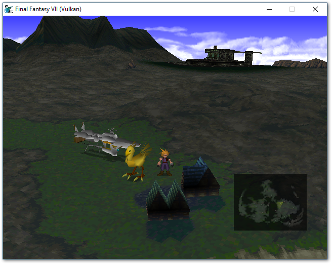
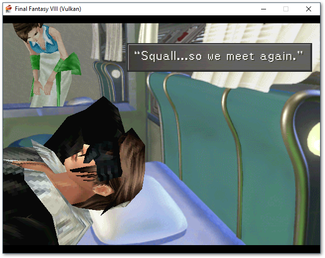
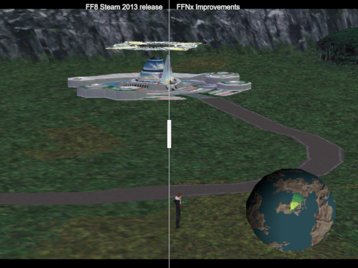

    

<div align="center">
  
  <br><strong><small>Kudos to <a href="https://www.instagram.com/aryaaiedail/">Cinzia Cancedda (aryaaiedail)</a></small></strong>
</div>

# FFNx

Next generation modding platform for Final Fantasy VII and Final Fantasy VIII (with native Steam 2013 release support)

## Introduction

FFNx is a continuing evolution of the [FF7_OpenGL](https://github.com/Aali132/ff7_opengl) driver, [made by Aali](http://forums.qhimm.com/index.php?topic=14922.0).

FFNx today in a nutshell:

- Uses an easy, drag-n-drop installation experience, see [How to Install](docs/how_to_install.md)
- Comes built-in with 7th Heaven v2.3 and higher
- Supports the newest video and audio codecs (WEBM, H.265, Ogg, etc.)
- Drastically enhances the gameplay experience compared to the vanilla experience
- Provides four stable rendering backends:
  - DirectX 11 (default)
  - DirectX 12
  - Vulkan
  - OpenGL

## The Team

FFNx is developed by a core team, currently composed of:

- [Julian Xhokaxhiu](https://github.com/julianxhokaxhiu) (TrueOdin, 🇪🇸 Spain)
- [Tang-Tang Zhou](https://github.com/tangtang95) (vertex2995, 🇮🇹 Italy)
- [Jérôme Arzel](https://github.com/myst6re) (myst6re, 🇫🇷 France)
- [CosmosXIII](https://github.com/CosmosXIII) (Cosmos, 🇯🇵 Japan)

We are always open for contributions via PRs, and in case you want to join the core team, feel free to approach us on Discord and we will evaluate on a case-by-case basis.

## Features

### As a user

#### FF7/FF8

- [/LARGEADDRESSAWARE](https://docs.microsoft.com/en-us/cpp/build/reference/largeaddressaware-handle-large-addresses?view=vs-2019) support. Up to 3.5GB of RAM available for mods (this requires the [4GB Patch](https://ntcore.com/?page_id=371) in your ff7.exe).
- High DPI support
- HDR support
- Up to 16x anisotropic support
- Up to 16x antialiasing support
- 5.1/7.1 audio output support
- Steam support; no game converter required
- Steam savegame preservation (you no longer lose saves created while FFNx is active)
- XInput controller support (Xbox 360 and compatible) with D-Pad working out-of-the-box
- Native speedhack support
- External music loading to replace original MIDIs
- The game continues to run within an inactive window

#### FF7
- 60 FPS
- eStore support! No game converter required
- Vertical centering for fields and movies
- Fullscreen battle scenes
- Menu cursor vertically aligned on the center of words
- Movies continue to play while running in an inactive window
- Movie volume respects global sound volume
- Steam sound and music volume configuration preservation (configure at your pleasure and on the next run it will be inherited)
- Configurable background transparency in battle dialogs (by default set to 75%)
- SFX volume change applies in real-time, instead of requiring a game reload
- Support for animated textures (like Aerith's waterfall, light fading, etc.)
- Support for soft-reset while you're playing, just like the PSX
- Support for battle toggle (enable/disable at your own pleasure)
- **Voice acting**! [Echo-S](https://www.tsunamods.com/echo-s-7/) was the first mod to take advantage of this!
- Support for external SFX audio effects
- Support for external ambient audio effects
- Support for external movie audio files (allows multiple videos to share the same audio)
- Support for external movie voice acting (dedicated audio layer only for voice acting on top of movies)
- Steam achievements can be unlocked while playing within FFNx
- Real-time light engine - You can now feel the game visually like never before
- Real-time camera control in battles
- Analogue controls using the full axis of your left analog stick

#### FF8
- Vibration support
- Analog controls improved support
- **Voice acting**! [Echo-S](https://www.tsunamods.com/echo-s-8/) was the first mod to take advantage of this!
- Various graphical patches for worldmap included
- Enable the VRAM debug window while playing in order to see how the engine uploads textures
- Support for external SFX audio effects
- Support for external movie audio files (allows multiple videos to share the same audio)
- Support for external movie voice acting (dedicated audio layer only for voice acting on top of movies)
- Support for external music audio with music resume after battle and improved volume transitions

### As a modder

- Game rendering inspection through [RenderDoc](https://renderdoc.org/)
- [DDS Texture support](https://wiki.beyondskyrim.org/wiki/Arcane_University:DDS_Data_Format) up to BC7 format, with PNG support as fallback
- Support for configurable external textures path using [mod_path](misc/FFNx.toml#L100)
- Support for an override layer of the data directory using [override_path](misc/FFNx.toml#L116)
- Support for MINIPSF audio files using the emulated PSX/PS2 AKAO Engine
- Support for [Hext](https://forums.qhimm.com/index.php?topic=13574.0) patching files inside of the [hext_patching_path](misc/FFNx.toml#L113)
- Debug in-game engine data through [imgui](https://github.com/ocornut/imgui) integration

## Documentation

For a more in-depth documentation feel free to visit the [docs/](docs/) folder.

## Screenshots

|                       Vanilla/Steam                                                                  |
| :--------------------------------------------------------------------------------------------------: |
|                                              |
|                                             |
| [](https://imgsli.com/MTg5NjQ2) |

## Tech Stack

If you're curious to know, FFNx makes use of:

- C++ code base
- Latest MSVC available on [Visual Studio 2022 Community Edition](https://visualstudio.microsoft.com/vs/features/cplusplus/)
- [vcpkg](https://vcpkg.io/) (dependency manager)
- [CMake](https://cmake.org/) (make files)
- [BGFX](https://github.com/bkaradzic/bgfx) (backend renderer)
- [BIMG](https://github.com/bkaradzic/bimg) (custom textures)
- [FFMpeg](https://www.ffmpeg.org/) with H/W accelleration support
- [VGMStream](https://github.com/losnoco/vgmstream) using FFMpeg as backend (with loop support!)
- [tomlplusplus](https://github.com/marzer/tomlplusplus) (configuration management)
- [StackWalker](https://github.com/JochenKalmbach/StackWalker) (log file stack traces)
- [pugixml](https://github.com/zeux/pugixml) (Steam XML manifest)
- [md5](http://www.zedwood.com/article/cpp-md5-function) (Steam XML manifest)
- [libpng](http://www.libpng.org/pub/png/libpng.html) (better and faster PNG texture support)
- [imgui](https://github.com/ocornut/imgui) (DevTools in-game interface)
- [imgui_club](https://github.com/ocornut/imgui_club) (imgui Memory Editor Widget)
- [xxhash](https://github.com/Cyan4973/xxHash) (fast hash extraction from paletted game texture data, aka animated textures)
- [SoLoud](https://github.com/jarikomppa/soloud) (audio engine used to playback audio, music or voice files)
- [openpsf](https://github.com/myst6re/openpsf) (MINIPSF emulation engine to playback PSX/PS2 music files)
- [Steamworks SDK](https://github.com/julianxhokaxhiu/SteamworksSDKCI) (support achievements for the Steam editions of games)
- [mimalloc](https://github.com/microsoft/mimalloc) (a compact general purpose allocator with excellent performance)

## How to build

Available build profiles:

- x86-Release (default, the same used to release artifacts in this Github page)
- x86-RelWithDebInfo (used while developing to better debug some issues)
- x86-MinSizeRel
- x86-Debug (prefer it if you want to use a debugger attached to the game)

Once the project is built you can find the output in this path: `.build/bin`

### Preparation

> **Please note:**
>
> FFNx uses vcpkg as a package manager to resolve dependencies. Failing to follow these steps will result in build errors.

0. Clone this repository using the `--recursive` flag, eg. `git clone --recursive https://github.com/julianxhokaxhiu/FFNx.git`

### NuGet

> **Please note:**
>
> This step will speed up your compilation times by avoiding the vcpkg dependencies rebuild.

0. Make sure you have [NuGet CLI installed](https://learn.microsoft.com/en-us/nuget/install-nuget-client-tools?tabs=windows#install-nugetexe).
1. [Create a Personal Access token ( classic )](https://github.com/settings/tokens/new) with the `write:packages` permission.
2. Open a `cmd` window and run the following commands ( replace `YOUR_GITHUB_USERNAME` and `YOUR_GITHUB_PAT` accordingly ):
```pwsh
$ nuget sources add -Name github -Source "https://nuget.pkg.github.com/julianxhokaxhiu/index.json" -Username YOUR_GITHUB_USERNAME -Password YOUR_GITHUB_PAT -StorePasswordInClearText
$ nuget setApiKey YOUR_GITHUB_PAT -Source "https://nuget.pkg.github.com/julianxhokaxhiu/index.json"
```

### Visual Studio

> **Please note:**
>
> By default Visual Studio will pick the **x86-Release** build configuration, but you can choose any other profile available.
> FFNx uses vcpkg as a package manager to resolve dependencies. Failing to follow these steps will result in build errors.

0. Download the the latest [Visual Studio Community](https://visualstudio.microsoft.com/vs/community/) installer
1. Run the installer and import this [.vsconfig](.vsconfig) file in the installer to pick the components required to build this project
2. Make sure you select the English Language pack in the language list before clicking Install
3. Go inside the [`vcpkg`](./vcpkg) folder and double click `bootstrap-vcpkg.bat`
4. Open a `cmd` window in [`vcpkg`](./vcpkg) and run the following command: `vcpkg integrate install`
5. Once installed, open this repository **as a folder** in Visual Studio
6. Choose as preset in the status bar the one you desire
7. Click the `Build` button

### Visual Studio Code

0. **REQUIRED!** Follow up the steps to install Visual Studio, which will also install the MSVC toolchain
1. Download and install the latest [Visual Studio Code](https://code.visualstudio.com/) release
2. Install the following extensions:
   - https://marketplace.visualstudio.com/items?itemName=ms-vscode.cpptools
   - https://marketplace.visualstudio.com/items?itemName=ms-vscode.cmake-tools
3. Open this repository as a folder in Visual Studio Code
4. Choose as preset in the status bar the one you desire
5. Click the button on the status bar `Build`

### Neovim with clangd (optional)

0. **REQUIRED!** Follow up the steps to install Visual Studio, which will also install the MSVC toolchain
1. **REQUIRED!** Have [Neovim](https://neovim.io/) installed with [clangd](https://clangd.llvm.org/) as LSP
2. Install the extension `Clang Power Tools` in [Visual Studio Community](https://visualstudio.microsoft.com/vs/community/)
3. Open the solution `FFNx.sln` under the `.build` directory with **Visual Studio Community** (**sln** file is generated by the build process)
4. Right-click on **FFNx** solution (under the **Solution Explorer**) then click on **Clang Power Tools** -> **Export Compilation Database**
5. Copy the `compile_commands.json` generated file into the root of the repository
6. Open **Neovim** and enjoy!

To build from the terminal (example with *RelWithDebInfo*):
- For dependency use: `cmake --preset RelWithDebInfo`
- For building the project: `cmake --build --preset RelWithDebInfo`

**NOTICE**: For the dependency step, make sure that PATH variable does not contain any UNIX command tools since vcpkg build process is based on UNIX tools.
Also on terminal it might not auto detect the kernel32_lib, so pass it with `-DCMAKE_LIBRARY_PATH=%kernel32_lib%`
(e.g. `cmake --preset RelWithDebInfo -DCMAKE_LIBRARY_PATH="C:\Program Files (x86)\Windows Kits\10\Lib\10.0.22621.0\um\x86"`)

## Auto-Formatting

### CMake Files

0. **REQUIRED!** Install [Python](https://www.python.org/)
1. Install [cmake-format](https://github.com/cheshirekow/cmake_format#installation) and make sure the binary is available in your PATH environment variable
2. **OPTIONAL!** Integrate it [in your own IDE](https://github.com/cheshirekow/cmake_format#integrations) (eg. for Visual Studio Code use [the relative extension](https://marketplace.visualstudio.com/items?itemName=cheshirekow.cmake-format))

## Support

FFNx offers multiple support channels, pick the one you prefer

### Forums

- Qhimm Forum: http://forums.qhimm.com/index.php?topic=19970.0
- Tsunamods Forum: https://forum.tsunamods.com/viewtopic.php?p=41#p41

### Discord

- Qhimm FFNx-FF7 (Final Fantasy VII only): https://discord.gg/N6M6pKS
- Qhimm FFNx-FF8 (Final Fantasy VIII only): https://discord.gg/u6M7DnY
- Tsunamods FFNx: https://discord.gg/Urq67Uz (remember to hit the Red Chocobo reaction!)

### Github

- Issues: https://github.com/julianxhokaxhiu/FFNx/issues

## Credits

This project could have not been a reality if those people would have not worked on FF7 and FF8 with their deep passion and knowledge.
FFNx makes use also of their work, and I will never be enough grateful to those people. The order is purely Alphabetical.

These people are:

- [Aali](http://forums.qhimm.com/index.php?action=profile;u=2862):
  - for the original Driver code FFNx is based on.
- [Chrysalis](http://forums.qhimm.com/index.php?action=profile;u=674):
  - for the battle fullscreen hext patch
  - for the menu cursor vertical centering in menu
- [CosmosXIII](https://github.com/CosmosXIII)
  - for the real-time light engine
  - for the real-time camera control in battles
  - for the analogue controls in FF7
- [DLPB](https://forums.qhimm.com/index.php?action=profile;u=6439):
  - for original Hext concept and specification that FFNx implemented as well
  - for the field vertical centering hext patch, which FFNx provides a default patch for
  - for the Soft-Reset original concept
  - for the no battle original concept
- [dziugo](http://forums.qhimm.com/index.php?action=profile;u=1660):
  - for the original FMV skip concept
- [ficedula](http://forums.qhimm.com/index.php?action=profile;u=68):
  - for 7h 1.x which FFNx provides support for
- [Iros](https://forums.qhimm.com/index.php?action=profile;u=21785):
  - for 7h 1.x which FFNx provides support for
- [JWP](http://forums.qhimm.com/index.php?action=profile;u=3772):
  - for imgui integration within FFNx
- [Kranmer](http://forums.qhimm.com/index.php?action=profile;u=4909)
  - for PHS save everywhere Hext patch
  - for the no battle original concept
- [Maki](http://forums.qhimm.com/index.php?action=profile;u=23937):
  - for FF8 UV Hext Patch in the world map, which FFNx provides a default patch for
  - for the help in getting the first iterations of FFNx running on FF8 2000/2013 release
- [myst6re](http://forums.qhimm.com/index.php?action=profile;u=4778):
  - for the great tools like Makou Reactor, Deling and many others he did which helped a lot in improving FF8 while working on the code
  - for the great help in the code implementing the MINIPSF emulation layer being present inside FFNx
  - for the heavy testing and lifting of a lot of bugs being catched in FFNx, for FF8
  - for the Steam savegame logic in the manifest.xml for FF8
  - for the real-time SFX volume change for FF7
- [quantumpencil](http://forums.qhimm.com/index.php?action=profile;u=23810) and [Nax](https://github.com/nax):
  - for the original CMake files FFNx has based its work upon
  - for all the help in getting some logics wired up in the game engine and a lot of hex addresses I would never been able to figure out myself
- [Satsuki](http://forums.qhimm.com/index.php?action=profile;u=24647):
  - for the heavy testing and lifting of a lot of bugs being catched in FFNx, for FF7
  - for the field vertical centering hext patch, which FFNx provides a default patch for
  - for a lot of hex addresses I would have never been able to figure out myself otherwise
  - for the original Speedhack concept and help in getting it natively into FFNx
- [Sebanisu](http://forums.qhimm.com/index.php?action=profile;u=22866):
  - for the help in getting the first iterations of FFNx running on FF8 2000/2013 release
  - for the heavy testing and lifting of a lot of bugs being catched in FFNx, for FF8
- [sithlord48](http://forums.qhimm.com/index.php?action=profile;u=6501):
  - for the Steam savegame logic in the manifest.xml for FF7
- [TurBoss](https://github.com/TurBoss):
  - for 7h 1.x source code release and FFNx enablement
- [unab0mb](https://forums.qhimm.com/index.php?action=profile;u=31071):
  - for the official integration of FFNx within 7thHeaven 2.3+
- [tangtang95](https://github.com/tangtang95)
  - for the 60FPS support in FF7
  - for the Steam achievements in FF7
- [Lord UrQuan](https://github.com/eve-atum)
  - for finding new and inventive ways to crash our test builds
  - for general documentation clean-up
- [LaZar00](https://github.com/LaZar00)
  - for the Snowboard TMD structures
- [ChthonVII](https://github.com/ChthonVII)
  - for the R&D needed to match modern display gamuts to the original PSX release

I'm sure I forgot many others. In case you feel you're missing here, feel free to open a PR! I'll be happy to include you because you deserve this.

## License

FFNx is released under GPLv3 license. You can get a copy of the license here: [COPYING.txt](COPYING.txt)

If you paid for FFNx, remember to ask for a refund from the person who sold you a copy. Also make sure you get a copy of the source code (if it was provided as binary only).

If the person who gave you this copy refuses to give you the source code, report it here: https://www.gnu.org/licenses/gpl-violation.html

All rights belong to their respective owners.
