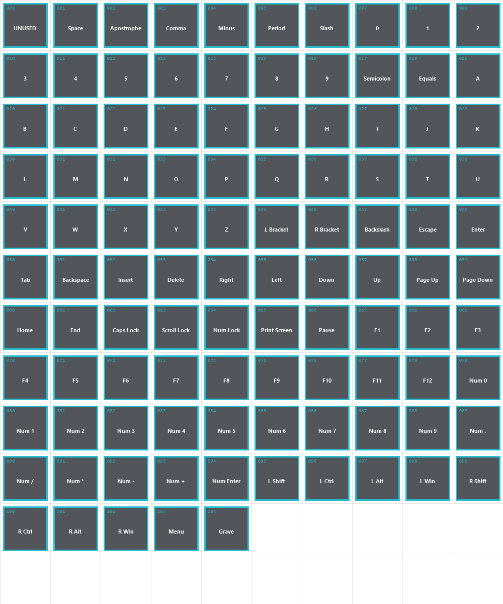
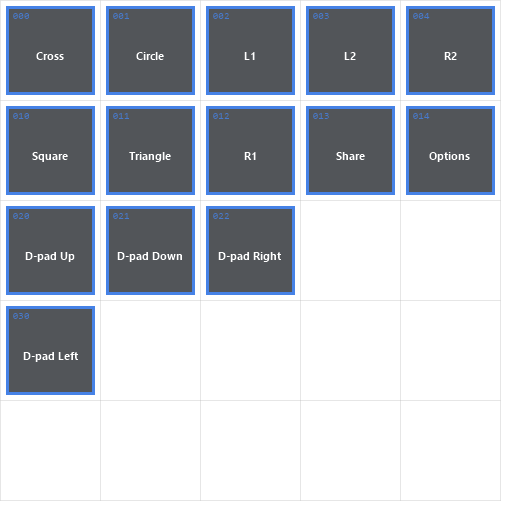
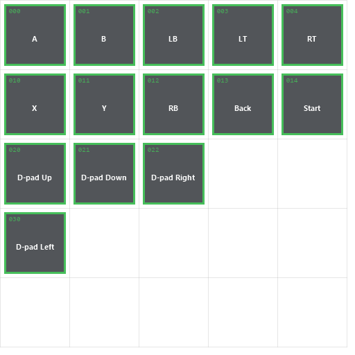
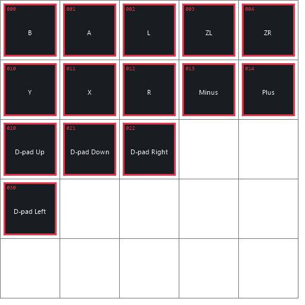

# Universal field button prompts

FFNx can replace button symbols in Final Fantasy VII field dialogue with prompts that match the player's current input device. The feature works with every game language supported by FFNx.

The prompt atlas is selected automatically when the menu graphics are loaded:

| Input device | Texture | Required size |
| --- | --- | --- |
| Keyboard | `buttons_pc_en.png` | 1000 x 1200 pixels |
| PlayStation-compatible controller | `buttons_ps4.png` | 512 x 512 pixels |
| Xbox-compatible controller | `buttons.png` | 512 x 512 pixels |
| Nintendo Switch-compatible controller | `buttons_switch.png` | 512 x 512 pixels |

The files must be installed in:

```text
<Final Fantasy VII installation>\data\png\
```

For example:

```text
C:\Games\Final Fantasy VII\data\png\buttons_pc_en.png
C:\Games\Final Fantasy VII\data\png\buttons_ps4.png
C:\Games\Final Fantasy VII\data\png\buttons.png
C:\Games\Final Fantasy VII\data\png\buttons_switch.png
```

These atlases are FFNx runtime assets and are loaded directly from `data\png`; they do not use the regular `mod_path` external-texture directory.

## Device selection and fallback

When SDL gamepad input is enabled, FFNx selects the Xbox, PlayStation, or Nintendo Switch atlas from the connected controller type. Switch Pro Controllers, individual Joy-Cons, and paired Joy-Cons use the Switch atlas. With the legacy input backend, XInput devices use the Xbox atlas, DirectInput joysticks use the PlayStation atlas, and keyboard input uses the keyboard atlas.

If the selected keyboard, Xbox, or Switch atlas is missing, FFNx falls back to `buttons_ps4.png`. If the selected image has the wrong dimensions, FFNx rejects it and records a warning in `FFNx.log`.

Restart the game after replacing an atlas. The selected path is reported in `FFNx.log` as `Using button prompt atlas`.

## Atlas rules

- Save the atlas as a PNG with transparency.
- Keep the exact canvas dimensions listed above.
- Every sprite occupies a 100 x 100 pixel cell.
- Do not move a sprite into another cell; the cell position defines its key or button.
- Keep artwork inside its cell to prevent neighboring prompts from bleeding into it.
- Prompts are rendered at 40 x 40 game-space units, so use bold shapes and avoid very small details.
- Unused cells should remain transparent.
- Filtering is enabled, so a small transparent margin around each symbol helps avoid edge artifacts.

## Keyboard atlas

`buttons_pc_en.png` is a 10-column by 12-row atlas. Cell 0 is unused. Cells 1 through 104 contain the supported keyboard keys, ordered left-to-right and then top-to-bottom.

The supplied template labels every populated cell with its index and key name:



The keyboard prompt shown for an action follows the player's current FF7 keyboard configuration. Modders therefore need to provide every labeled key cell, not only the default bindings.

## Controller atlases

All controller textures use the same cell layout. This lets a mod replace only the artwork while FFNx keeps the action and controller mapping behavior consistent.

| Row | Column 0 | Column 1 | Column 2 | Column 3 | Column 4 |
| --- | --- | --- | --- | --- | --- |
| 0 | Cancel | OK | L1 | L2 | R2 |
| 1 | Switch | Menu | R1 | Assist | Start |
| 2 | Up | Down | Right | Unused | Unused |
| 3 | Left | Unused | Unused | Unused | Unused |
| 4 | Unused | Unused | Unused | Unused | Unused |

The action names describe FF7's logical controls. FFNx honors the player's controller configuration before selecting the physical button symbol.

The templates use the same layout but different labels to make their intended controller family clear. Replace the dummy labels with original artwork appropriate for the target device.

### Playstation



### XBox



### Nintendo Switch



## Adding prompts to field dialogue

Universal prompts must be encoded in the text payload of an `flevel` `MESSAGE` or `ASK`
instruction. They are field text control codes, not field script opcodes. FFNx replaces each
recognized control code with the key or controller symbol currently assigned to that action.

Use a field editor that preserves control codes, or insert the bytes through its raw/hex text
mode. Do not write literal labels such as `[OK]`, `Num Enter`, or `Circle`: literal text cannot
follow input remapping or device changes.

The original single-byte field controls are available in every language:

| Bytes | Logical action |
| --- | --- |
| `F6` | OK |
| `F7` | Menu |
| `F8` | Switch |
| `F9` | Cancel |

Extended controls expose the remaining actions. Use the encoding that matches the text format
of the target `flevel`:

| Logical action | Non-Japanese text | Japanese text |
| --- | --- | --- |
| OK | `F6 10` | `F6 33` |
| L1 | `F6 11` | `F6 34` |
| L2 | `F6 12` | `F6 35` |
| R1 | `F6 13` | `F6 36` |
| R2 | `F6 14` | `F6 37` |
| Start | `F6 15` | `F6 38` |
| Assist | `F6 16` | `F6 39` |
| Up | `F6 17` | `F6 3A` |
| Down | `F6 18` | `F6 3B` |
| Left | `F6 19` | `F6 3C` |
| Right | `F6 0C` | `F6 3D` |

For example, a non-Japanese dialogue that displays the configured L1 and R1 controls followed
by `: TURN` contains this text sequence:

```text
F6 11 0F F6 13 1A 00 54 55 52 4E
^^^^^    ^^^^^
  L1       R1
```

The bytes between and after the prompts are normal encoded field text; their exact values depend
on the game's text encoding. The important parts are the complete two-byte prompt sequences.

Keep these points in mind when editing or rebuilding an `flevel`:

- Insert controls only inside dialogue text. Do not add them to the surrounding field script.
- Preserve both bytes of every extended control during export, translation, and reimport.
- Use the Japanese column only for dialogue encoded with the Japanese field character set.
- Treat each prompt as one displayed item when manually sizing a fixed dialogue window.
- FFNx-aware automatic window sizing recognizes these controls and includes their prompt width.
- Test with keyboard and controller input because the same field control selects different atlas
  artwork at runtime.

## Packaging a button pack

A distributable pack can contain this structure:

```text
data\
  png\
    buttons_pc_en.png
    buttons_ps4.png
    buttons.png
    buttons_switch.png
```

All four files are recommended. A controller-only pack may omit the keyboard atlas, but FFNx will then use `buttons_ps4.png` when no controller is connected. A keyboard-only pack should also include a PlayStation atlas because it is the final fallback.

Do not rename the files or change their dimensions. Existing files in `data\png` should be backed up before installing another button pack.
